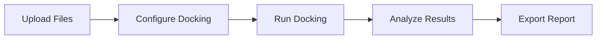

# BioDockify Docking Studio - Complete Software Documentation
**Version 1.1.0 | Desktop Molecular Docking Application**

---

## 📋 Overview

**BioDockify Docking Studio** is a professional-grade desktop application for molecular docking and visualization. It provides an integrated environment for drug discovery researchers to perform ligand-protein docking simulations, analyze molecular interactions, and visualize binding modes.

### Key Capabilities
- **Molecular Docking** using AutoDock Vina and Gnina engines
- **3D Visualization** of protein-ligand complexes
- **Interaction Analysis** (hydrogen bonds, hydrophobic contacts, π-stacking)
- **ADMET Prediction** and drug-likeness calculations
- **Batch Processing** for high-throughput virtual screening
- **AI-Powered Insights** via Agent Zero integration

---

## 🏗️ Software Architecture

```
BioDockify Docking Studio
├── Frontend (PyQt6 Desktop UI)
│   ├── Main Window
│   ├── Upload Widget
│   ├── Configuration Widget
│   ├── Progress Widget
│   ├── Results Widget
│   └── Agent Zero Widget
│
├── Backend Services
│   ├── Docking Engines (Vina, Gnina)
│   ├── Molecular Parsers (PDB, MOL2, SDF)
│   ├── Interaction Analyzers
│   └── API Layer (FastAPI)
│
├── Core Modules
│   ├── Docker Management
│   ├── Database Layer
│   ├── Checkpoint/Recovery
│   └── Mathematical Operations
│
└── Infrastructure
    ├── PyInstaller Build
    ├── NSIS Installer
    └── CI/CD Pipeline
```

---

## 📁 Directory Structure

```
Docking-studio/
│
├── src/                          # Source Code
│   ├── biodockify_main.py        # Application entry point
│   ├── config.py                 # Configuration management
│   ├── database.py               # SQLite database operations
│   ├── docker_manager.py         # Docker container management
│   ├── vina_engine.py            # AutoDock Vina integration
│   ├── oddt_analyzer.py          # ODDT interaction analysis
│   ├── rdkit_calculator.py       # RDKit molecular calculations
│   ├── checkpoint_manager.py     # Job checkpoint/recovery
│   ├── recovery_manager.py       # Error recovery handling
│   ├── agent_zero.py             # AI assistant module
│   │
│   ├── ui/                       # User Interface (PyQt6)
│   │   ├── main_window.py        # Main application window
│   │   ├── upload_widget.py      # File upload interface
│   │   ├── configuration_widget.py # Docking parameters
│   │   ├── progress_widget.py    # Job progress tracking
│   │   ├── results_widget.py     # Results visualization
│   │   ├── agent_zero_widget.py  # AI chat interface
│   │   ├── theme.py              # UI styling/theming
│   │   └── styles/               # CSS stylesheets
│   │
│   ├── core/                     # Core Analysis Modules
│   │   ├── engines/              # Molecular engines
│   │   │   ├── molecular_engine.py
│   │   │   └── interaction_pipeline.py
│   │   ├── parsers/              # File format parsers
│   │   │   ├── pdb_parser.py
│   │   │   ├── mol2_parser.py
│   │   │   └── sdf_parser.py
│   │   ├── analyzers/            # Analysis algorithms
│   │   │   ├── bond_detector.py
│   │   │   └── interaction_analyzer.py
│   │   ├── math/                 # Mathematical utilities
│   │   │   └── safe_numpy.py
│   │   ├── exceptions.py         # Custom exceptions
│   │   ├── spatial_hash.py       # Spatial hashing
│   │   └── validators.py         # Input validation
│   │
│   ├── api/                      # REST API Layer
│   │   ├── main.py               # FastAPI application
│   │   ├── upload.py             # File upload endpoints
│   │   ├── vina.py               # Docking endpoints
│   │   ├── job_manager.py        # Job queue management
│   │   ├── docker.py             # Docker status API
│   │   ├── oddt.py               # Analysis endpoints
│   │   ├── rdkit.py              # Calculation endpoints
│   │   ├── checkpoint.py         # Checkpoint API
│   │   └── agent_zero.py         # AI chat API
│   │
│   ├── services/                 # Business Logic
│   │   ├── analysis_service.py   # Analysis orchestration
│   │   └── parsing_service.py    # File parsing service
│   │
│   ├── models/                   # Data Models
│   ├── schemas/                  # API Schemas
│   ├── utils/                    # Utility functions
│   └── templates/                # Configuration templates
│
├── docs/                         # Documentation
├── tests/                        # Unit tests
├── scripts/                      # Build scripts
│
├── build_windows.spec            # PyInstaller spec
├── installer.nsi                 # NSIS installer script
├── docker-compose.yml            # Docker configuration
├── requirements.txt              # Python dependencies
└── .github/workflows/            # CI/CD pipelines
```

---

## 🔬 BioDockviz Integration (v1.1.0)

The following modules were integrated from the **BioDockviz** molecular visualization platform:

### Core Engines (`src/core/engines/`)
| Module | Features |
|--------|----------|
| `molecular_engine.py` | Atom coordinate handling, bond detection, ring perception |
| `interaction_pipeline.py` | Automated interaction detection workflow |

### File Parsers (`src/core/parsers/`)
| Parser | Capabilities |
|--------|--------------|
| `pdb_parser.py` | Parse PDB files, extract atoms, residues, chains |
| `mol2_parser.py` | Parse Tripos MOL2 format with bond orders |
| `sdf_parser.py` | Parse SD/SDF multi-molecule files |

### Analyzers (`src/core/analyzers/`)
| Analyzer | Function |
|----------|----------|
| `bond_detector.py` | Covalent bond detection using distance criteria |
| `interaction_analyzer.py` | H-bonds, hydrophobic contacts, π-stacking detection |

### Mathematical Utilities (`src/core/math/`)
| Module | Purpose |
|--------|---------|
| `safe_numpy.py` | Safe numerical operations with overflow protection |

### Services (`src/services/`)
| Service | Role |
|---------|------|
| `analysis_service.py` | Orchestrates multi-step molecular analysis |
| `parsing_service.py` | Unified file parsing interface |

### Core Utilities
- `spatial_hash.py` - Spatial hashing for efficient neighbor searches
- `validators.py` - Input validation for molecular data
- `exceptions.py` - Custom exception classes

---

## ✨ Features

### 1. Molecular Docking
| Feature | Description |
|---------|-------------|
| **AutoDock Vina** | High-precision docking engine |
| **Gnina** | CNN-based scoring function |
| **Flexible Docking** | Allows ligand flexibility |
| **Batch Mode** | Process multiple ligands simultaneously |
| **Grid Box Definition** | Define search space parameters |

### 2. File Format Support
| Format | Type | Support |
|--------|------|---------|
| PDB | Protein structure | ✅ Read/Write |
| PDBQT | Vina input | ✅ Auto-convert |
| MOL2 | Ligand | ✅ Read/Write |
| SDF | Multi-molecule | ✅ Read/Write |

### 3. Interaction Analysis
- **Hydrogen Bonds** - Donor-acceptor detection
- **Hydrophobic Contacts** - Non-polar interactions
- **π-Stacking** - Aromatic ring interactions
- **Salt Bridges** - Charged residue contacts
- **Metal Coordination** - Metal ion interactions

### 4. Visualization
- **3D Molecular Viewer** - Interactive structure display
- **Binding Site Analysis** - Pocket visualization
- **Interaction Diagrams** - 2D ligand interaction maps
- **Pose Comparison** - Multiple pose overlay

### 5. Drug Discovery Tools
| Tool | Purpose |
|------|---------|
| **Lipinski's Rule of 5** | Drug-likeness filter |
| **PSA/HBA/HBD** | Molecular property calculation |
| **LogP Estimation** | Lipophilicity prediction |
| **ADMET Prediction** | Absorption/toxicity estimation |

### 6. AI Assistant (Agent Zero)
- **Natural Language Queries** - Ask questions about results
- **Insight Generation** - Automated analysis summaries
- **Literature Search** - Related research suggestions
- **Parameter Recommendations** - Optimal docking settings

### 7. Job Management
- **Job Queue** - Queue multiple docking jobs
- **Checkpointing** - Resume interrupted jobs
- **Progress Tracking** - Real-time status updates
- **Error Recovery** - Automatic failure handling

---

## 🔧 Technical Specifications

### System Requirements
| Component | Minimum | Recommended |
|-----------|---------|-------------|
| OS | Windows 10 x64 | Windows 11 x64 |
| RAM | 8 GB | 16 GB |
| Storage | 2 GB | 10 GB |
| Docker | Required | Desktop 4.x |

### Technology Stack
| Layer | Technology |
|-------|------------|
| **UI Framework** | PyQt6 |
| **Backend API** | FastAPI |
| **Database** | SQLite |
| **Docking Engine** | AutoDock Vina, Gnina |
| **Chemistry** | RDKit, ODDT |
| **Packaging** | PyInstaller |
| **Installer** | NSIS |
| **CI/CD** | GitHub Actions |

### Dependencies
```
PyQt6>=6.4.0
fastapi>=0.100.0
uvicorn>=0.22.0
rdkit>=2023.03.1
oddt>=0.7.0
docker>=6.0.0
numpy>=1.24.0
scipy>=1.10.0
pandas>=2.0.0
pydantic>=2.0.0
```

---

## 🚀 Installation

### Windows Installer
1. Download `BioDockify-Setup-1.1.0.exe`
2. Run installer with Administrator privileges
3. Follow installation wizard
4. Install Docker Desktop when prompted
5. Launch from Start Menu

### From Source
```bash
git clone https://github.com/tajo9128/Docking-studio.git
cd Docking-studio
pip install -r requirements.txt
python src/biodockify_main.py
```

---

## 📊 Workflow



### Step-by-Step:
1. **Upload** - Load protein (PDB) and ligand (MOL2/SDF) files
2. **Configure** - Set grid box, exhaustiveness, output poses
3. **Dock** - Execute docking simulation via Docker containers
4. **Analyze** - View binding scores, interactions, 3D visualization
5. **Export** - Generate PDF reports, download pose files

---

## 📄 License

MIT License - Free for academic and commercial use.

---

## 📞 Support

- **Documentation**: `/docs/` folder
- **Issues**: GitHub Issues
- **Email**: support@biodockify.com

---

*BioDockify Docking Studio v1.1.0 - Unified Molecular Docking Platform*
